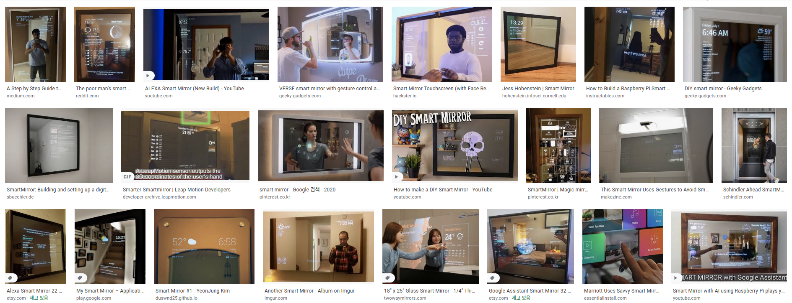

# SmartMirror

## Purpose
[Magic Mirror]라는 오픈소스 프로젝트를 통해서 스마트미러를 많이 만들었었다. 학생들한테 강의도 하고 포스팅도 했었지만 정작 어떻게 동작하는지 제대로 알지 못했다. 내가 잘 아는 파이썬 코드를 통해서 SmartMirror를 만들어보자!

## Goal

### Design
디자인적으로 목표는 다음과 같은 이미지 중에 하나가 되지 않을까 싶다.. 예뻐보이는 스마트미러...

### Function
기능적 목표도 사실 기존의 MagicMirror 프로젝트를 많이 모방하지만 사용자 행동에 따라 다른 행동을 하게끔 딥러닝 모델을 가져와 사용하고자 한다.

- [ ] 시계
- [ ] 날씨
- [ ] 뉴스
- [ ] 카메라 구현
- [ ] 행동에 따라 기능 동작 (지금은 모호하지만 구체적으로 바뀌어야 함)
 
## Project Schedule

오늘은 2020년 11월 26일이다.

하루에 2시간씩 이 프로젝트를 할 것이다. 

더도 말고 덜도 말고 딱 2시간!!

## Implement
Python

PyQt5

